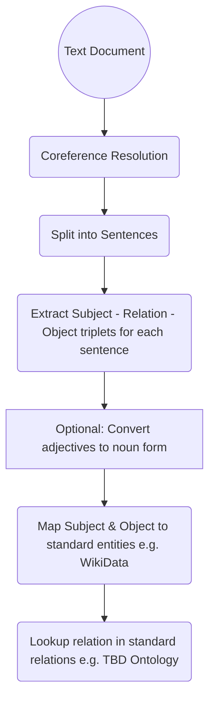

# Machine Reasoning
Efficient, Explainable Machine Reasoning

The goal is to use efficient methods (most often, far more efficient than LLM), wherever possible, to implement the desired functions

There are at least 2 type of **reasoning tasks** that this system must be able to perform

1. **Question Answering using a Knowledge Base**: Given a knowledge graph (e.g. WikiData), and a question (either in natural language, or in a structured form), use graph search and inference to find the answer (or at least a structured intermediate answer, that can be used to construct the desired outcome)

> A related requirement is to be able to build and share knowledge base. A mechanism which enables users of the system to collect articles, references, research papers and associated learning into the knowledge base. Further, while it is encouraged that the gathered knowledge is shared publically, there may be cases where certain users may want to keep the knowledge private (e.g. an independent researcher or an organization), and for such situations, the combined knowledge base must restrict access for the confidential information

2. **Reasoning Tasks**: This is not the immediate focus, but an attempt to solve some or all of the type of problems defined in reasoning benchmarks like [ARC AGI](https://arcprize.org/arc-agi)

# Question Answering using a Knowledge Base

While WikiData is a powerful knowledge base, it does not support inference. One of the primary thought process is to leverage graph inference to solve problems (where possible) that're well defined using factual rules.

## Graph Database with Inference

TODO: Add brief on TypeDB and TypeQL

## Knowledge Base Development

### User Contributions

### Learning from Peer Reviewed Content

Map natural language, **peer reviewed** information (from textbook chapters, technical papers or articles) to standard ontology and knowledge base such as [WikiData](https://www.wikidata.org/wiki/Wikidata:Main_Page)

Some interesting work related to information extraction
 
 * [Babelscape/rebel-large · Hugging Face](https://huggingface.co/Babelscape/rebel-large), referenced in [this article](https://medium.com/data-science/extract-knowledge-from-text-end-to-end-information-extraction-pipeline-with-spacy-and-neo4j-502b2b1e0754)

 * Use of [SpaCy entity, dependency and noun chunk extraction]() to augment and improve quality of extraction

#### Datasets

 * [Children Story](https://www.kaggle.com/datasets/edenbd/children-stories-text-corpus)

### Identify Relation Type

Once extracted triple is normalized, in order to integrate inference capabilities (with TypeDB), we need to identify the type of relation:

1. Subject is a type of Object: Defines a new type (subclass or instance of)
2. Object is an attribute of the Subject (define attribute for type of subject)
3. A proper relation between two entities

### Proposed Flow

Following is the initial proposal for translating natural language knowledge into a structured graph



# System Components

Below are that components or the functions of this project

## Sentence To Subgraph

### Homograph Test Pairs

#### Pair 1

* Sentence 1: The fisherman sat near the bank.
* Sentence 2: She deposited money in the bank.

#### Pair 2

* Sentence 1: The bat flew across the cave.
* Sentence 2: He swung the bat during the match.

#### Pair 3

* Sentence 1: The crane stood in the marsh.
* Sentence 2: The crane lifted the steel beam.

#### Pair 4

* Sentence 1: The bark was rough on the tree.
* Sentence 2: The dog began to bark loudly.

#### Pair 5

* Sentence 1: The match burned quickly.
* Sentence 2: The football match ended late.

### Normal Sentence Test Pairs

#### Pair 6

* Sentence 1: The cat chased the mouse.
* Sentence 2: The mouse hid under the table.

#### Pair 7

* Sentence 1: The teacher explained the lesson clearly.
* Sentence 2: The students wrote notes carefully.

#### Pair 8

* Sentence 1: The car stopped at the signal.
* Sentence 2: The driver opened the door slowly.

#### Pair 9

* Sentence 1: The boy kicked the ball.
* Sentence 2: The ball rolled into the garden.

#### Pair 10

* Sentence 1: The scientist observed the experiment.
* Sentence 2: The experiment produced accurate results.

### Why was ths function even created?
### What does the function do?
```python
def sentence_to_subgraph
    """
    Convert a sentence into standardized knowledge triplets using
    contextual information and external knowledge sources.

    The function extracts semantic relationships from natural language
    text and represents them as structured triplets in the form:

        (subject, relation, object)

    Domain-specific understanding is supported through textbook-derived
    knowledge, while general-world concepts and entities are enriched
    using Wikidata information.

    Args:
        sentence (str):
            The input sentence to analyze and convert into triplets.

        context (str):
            Additional contextual text such as surrounding sentences,
            paragraphs, or documents that help resolve meaning,
            references, and entity relationships.

        textbook_data (dict):
            Structured domain knowledge extracted from textbooks or
            curated educational sources. Used for domain-specific
            terminology, definitions, and relationships.

        wikidata_data (dict):
            General-purpose world knowledge obtained from Wikidata,
            including entities, aliases, categories, and relationships.

    Returns:
        list[tuple[str, str, str]]:
            A list of standardized semantic triplets where each triplet
            is represented as:

                (subject, relation, object)

            Example:
                [
                    ("Newton", "developed", "Laws of Motion"),
                    ("Force", "is_related_to", "Mass")
                ]

    Raises:
        ValueError:
            If the input sentence is empty or invalid.

        TypeError:
            If any input argument has an unexpected type.
    """
    
```
### How does this function work?
The system begins with a knowledge triplet such as “cat eats fish” and separates the sentence into individual words through tokenization. It then applies English grammar rules to identify nouns, verbs, adjectives, prepositions, and other parts of speech so the structure of the sentence becomes clear. After this, the code checks for homographs, which are words that share the same spelling but may have different meanings, such as “bank” or “bat.” Instead of using AI models, the system relies only on surrounding grammar patterns, modifiers, and sentence structure to infer the correct meaning. Once the meaning is inferred, the system matches the concept with a Wikidata entity and generates a SPARQL query to retrieve related entity IDs, properties, and relationships from Wikidata for semantic validation.

After validating meanings with Wikidata and SPARQL results, the system determines the type of relationship between concepts and converts them into graph nodes and edges. Actions create subject-to-object links, descriptive words become attributes, and prepositional phrases add context connections to the graph. The system then resolves pronouns and checks grammar dependencies to discover how concepts connect across the sentence. Related concepts are grouped into subgraphs, and if a subject or object already exists in another graph, the structures are merged together. Finally, the code validates grammar consistency and outputs a clean semantic subgraph that can later be used for reasoning systems, semantic search, structured knowledge databases, or advanced knowledge graph applications.

```mermaid
flowchart TD

    A[Input Knowledge Triplet] --> B[Tokenize Words]

    B --> C[Run English Grammar Analysis]
    C --> D[Identify Parts of Speech]

    D --> D1[Detect Homographs]
    D1 --> D2[Analyze Surrounding Grammar]
    D2 --> D3[Infer Meaning from Sentence Structure]

    D3 --> W1[Match Concept with Wikidata Entity]
    W1 --> W2[Generate SPARQL Query]
    W2 --> W3[Query Wikidata Knowledge Graph]
    W3 --> W4[Retrieve Wikidata IDs and Relationships]
    W4 --> W5[Validate Meaning Using Retrieved Knowledge]

    W5 --> E{Determine Relation Type}

    E -->|Verb| F[Create Subject to Object Edge]
    E -->|Attribute| G[Attach Attribute Node]
    E -->|Compound Noun| H[Merge Related Nouns]
    E -->|Preposition| I[Create Context Edge]

    F --> J[Build Initial Subgraph]
    G --> J
    H --> J
    I --> J

    J --> K[Resolve Pronouns]
    K --> L[Detect Grammar Dependencies]
    L --> M[Group Connected Concepts]

    M --> N{Shared Subject or Object?}

    N -->|Yes| O[Merge Into Existing Subgraph]
    N -->|No| P[Create New Subgraph]

    O --> Q[Update Graph Connections]
    P --> Q

    Q --> R[Validate Grammar Consistency]
    R --> S[Output Final Subgraph]

    subgraph KEY[Colour Key]
        K1[Green = Input or Output]
        K2[Blue = Grammar Processing]
        K3[Cyan = Meaning Inference]
        K4[Yellow = Wikidata and SPARQL]
        K5[Orange = Decision]
        K6[Purple = Graph Construction]
        K7[Red = Validation]
    end

    style A fill:#4CAF50,stroke:#1B5E20,color:#ffffff
    style S fill:#4CAF50,stroke:#1B5E20,color:#ffffff
    style K1 fill:#4CAF50,stroke:#1B5E20,color:#ffffff

    style B fill:#2196F3,stroke:#0D47A1,color:#ffffff
    style C fill:#2196F3,stroke:#0D47A1,color:#ffffff
    style D fill:#2196F3,stroke:#0D47A1,color:#ffffff
    style K fill:#2196F3,stroke:#0D47A1,color:#ffffff
    style L fill:#2196F3,stroke:#0D47A1,color:#ffffff
    style K2 fill:#2196F3,stroke:#0D47A1,color:#ffffff

    style D1 fill:#00BCD4,stroke:#006064,color:#ffffff
    style D2 fill:#00BCD4,stroke:#006064,color:#ffffff
    style D3 fill:#00BCD4,stroke:#006064,color:#ffffff
    style K3 fill:#00BCD4,stroke:#006064,color:#ffffff

    style W1 fill:#FDD835,stroke:#F57F17,color:#000000
    style W2 fill:#FDD835,stroke:#F57F17,color:#000000
    style W3 fill:#FDD835,stroke:#F57F17,color:#000000
    style W4 fill:#FDD835,stroke:#F57F17,color:#000000
    style W5 fill:#FDD835,stroke:#F57F17,color:#000000
    style K4 fill:#FDD835,stroke:#F57F17,color:#000000

    style E fill:#FF9800,stroke:#E65100,color:#ffffff
    style N fill:#FF9800,stroke:#E65100,color:#ffffff
    style K5 fill:#FF9800,stroke:#E65100,color:#ffffff

    style F fill:#9C27B0,stroke:#4A148C,color:#ffffff
    style G fill:#9C27B0,stroke:#4A148C,color:#ffffff
    style H fill:#9C27B0,stroke:#4A148C,color:#ffffff
    style I fill:#9C27B0,stroke:#4A148C,color:#ffffff
    style J fill:#9C27B0,stroke:#4A148C,color:#ffffff
    style M fill:#9C27B0,stroke:#4A148C,color:#ffffff
    style O fill:#9C27B0,stroke:#4A148C,color:#ffffff
    style P fill:#9C27B0,stroke:#4A148C,color:#ffffff
    style Q fill:#9C27B0,stroke:#4A148C,color:#ffffff
    style K6 fill:#9C27B0,stroke:#4A148C,color:#ffffff

    style R fill:#F44336,stroke:#B71C1C,color:#ffffff
    style K7 fill:#F44336,stroke:#B71C1C,color:#ffffff
```

