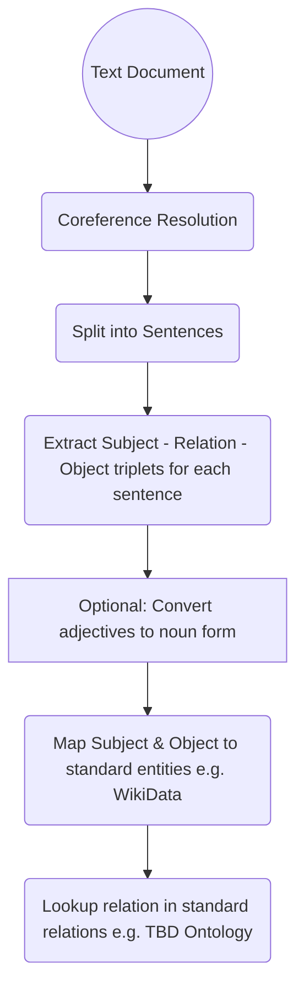

# Machine Reasoning
Efficient, Explainable Machine Reasoning

The goal is to use efficient methods (most often, far more efficient than LLM), wherever possible, to implement the desired functions

There are at least 2 type of **reasoning tasks** that this system must be able to perform

1. **Question Answering using a Knowledge Base**: Given a knowledge graph (e.g. WikiData), and a question (either in natural language, or in a structured form), use graph search and inference to find the answer (or at least a structured intermediate answer, that can be used to construct the desired outcome)

> A related requirement is to be able to build and share knowledge base. A mechanism which enables users of the system to collect articles, references, research papers and associated learning into the knowledge base. Further, while it is encouraged that the gathered knowledge is shared publically, there may be cases where certain users may want to keep the knowledge private (e.g. an independent researcher or an organization), and for such situations, the combined knowledge base must restrict access for the confidential information

2. **Reasoning Tasks**: This is not the immediate focus, but an attempt to solve some or all of the type of problems defined in reasoning benchmarks like [ARC AGI](https://arcprize.org/arc-agi)

# Question Answering using a Knowledge Base

While WikiData is a powerful knowledge base, it does not support inference. One of the primary thought process is to leverage graph inference to solve problems (where possible) that're well defined using factual rules.

## Graph Database with Inference

TODO: Add brief on TypeDB and TypeQL

## Knowledge Base Development

### User Contributions

### Learning from Peer Reviewed Content

Map natural language, **peer reviewed** information (from textbook chapters, technical papers or articles) to standard ontology and knowledge base such as [WikiData](https://www.wikidata.org/wiki/Wikidata:Main_Page)

Some interesting work related to information extraction
 
 * [Babelscape/rebel-large · Hugging Face](https://huggingface.co/Babelscape/rebel-large), referenced in [this article](https://towardsdatascience.com/extract-knowledge-from-text-end-to-end-information-extraction-pipeline-with-spacy-and-neo4j-502b2b1e0754)

 * Use of [SpaCy entity, dependency and noun chunk extraction]() to augment and improve quality of extraction

#### Datasets

 * [Children Story](https://www.kaggle.com/datasets/edenbd/children-stories-text-corpus)

### Identify Relation Type

Once extracted triple is normalized, in order to integrate inference capabilities (with TypeDB), we need to identify the type of relation:

1. Subject is a type of Object: Defines a new type (subclass or instance of)
2. Object is an attribute of the Subject (define attribute for type of subject)
3. A proper relation between two entities

### Proposed Flow

Following is the initial proposal for translating natural language knowledge into a structured graph

